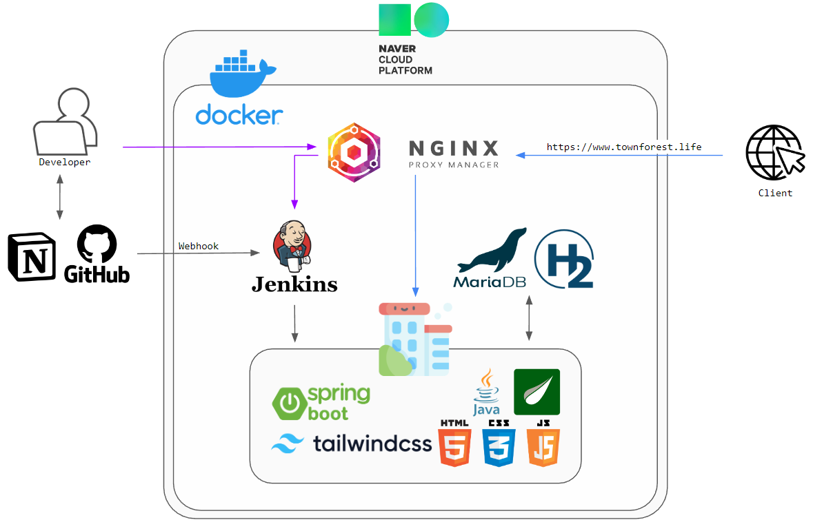

<!-- Improved compatibility of back to top link: See: https://github.com/othneildrew/Best-README-Template/pull/73 -->

<!-- PROJECT LOGO -->
 

  

<h3 align="center">타운 포레스트(Town Forest)</h3>

  

    아파트 공용 시설을 신청하는데 편리함을 주는 서비스
     
  

<!-- TABLE OF CONTENTS -->

  
목차

  <ol>
    <li>
      <a href="#프로젝트-개요">프로젝트 개요</a>
      <ul>
        <li><a href="#사용-기술">사용 기술</a></li>
      </ul>
    </li>

  <li>
    <a href="#시작하기">시작하기</a>
  </li>

  <li>
    <a href="#각-기능별-간략-소개">각 기능별 간략 소개</a>
  </li>

<li>
<a href="#프로젝트-결과물">프로젝트 결과물</a>
</li>

<li>
<a href="#기능별-담당">기능별 담당</a>
</li>
  </ol>

<!-- ABOUT THE PROJECT -->

## 프로젝트 개요

<!-- [![Product Name Screen Shot][product-screenshot]](https://example.com) -->

- `아파트 공용 시설(헬스장, 독서실 등)`을 이용하기 위해 관리사무소에 방문하여 예약하는 번거로움 해소
- 번거로움 뿐만이 아닌 `이용 관련 문의` 등의 불편함 발생
    - 관리자가 자리를 비울 경우 예약 불가능
    - 시설 관리의 주체가 관리사무소가 아닌 다른 업체라면, 해당 업체에 문의하는 번거로움
- `관리하는 직원의 업무 효율성 증가`
    - 주민들에게 이용 방법을 안내하는 불필요한 일 감소
- 모바일 웹을 개발하여 주민과 관리자 모두 `윈-윈(Win-Win)` 할 수 있는 페이지 제작

### 사용 기술

<!-- GETTING STARTED -->

## 시작하기

[https://www.townforest.life](https://www.townforest.life)

## 각 기능별 간략 소개

- 회원
    - 서비스 회원가입 -> 아파트 계정 요청 -> 관리자 승인 후 서비스 이용 가능
    - 탈퇴 : 회원 정보 삭제, 단 이용 기록에는 사용자의 정보가 남는다.

- 공지사항 : 아파트에 속한 관리자들(헬스장, 독서실, 아파트)만 게시글 CRUD 기능 동작
    - 일반 주민의 경우 읽기만 가능

- 헬스장 : 헬스장 이용권 구입, 이용권 일시 정지, 이용내역 조회 등
- 헬스장 관리자 : 헬스장 이용 중인 주민 조회, 이용권 관리, 전체 주민 이용내역 조회 등

- 독서실 : 아파트 독서실 자리 예약 / 반납, 이용내역 조회 등
- 독서실 관리자 : 이용 중인 주민 조회, 전체 주민 이용내역 조회 등

- 방문 차량 : 아파트 주민이 특정 날에 방문할 차량을 등록, 삭제 등
- 아파트 관리자 : 과거/오늘/미래 날짜에 방문할 차량의 목록 확인 등

- 게스트하우스 : 아파트 내 위치한 게스트하우스 예약 가능
- 게스트하우스 관리자 : 예약 승인/반려 기능 및 이용 내역 조회 가능

- 주민 차량 등록 : 아파트 주민 차량 등록, 세대원 차량 확인 등

## 프로젝트 결과물

- [프로젝트 시연 영상]()
- [노션 페이지](https://www.notion.so/Town-Forest-f0e0e0581cc14bfabeda5dcc35f4117d)

## 기능별 담당

- 박철현 - 헬스장 기능 및 공지사항 기능
  -[GitHub](https://github.com/CheorHyeon)
- 방유진 - 회원 기능
  -[GitHub](https://github.com/u-jineeee)
- 이송이 - 독서실, 방문 차량 등록, 게스트하우스 기능
  -[GitHub](https://github.com/elephantLikesApple)
- 이은찬 - 세대별 차량 등록 기능
  -[GitHub](https://github.com/Chan0521)

<!-- 템플릿 출처 : https://github.com/othneildrew/Best-README-Template -->
